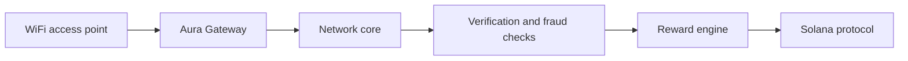

# Aura architecture

## Boundary

WiFi traffic is ordinary IP traffic. Aura never writes browsing content, DNS queries, precise private-home coordinates, router passwords, or raw device identifiers to Solana.

## Components

- Gateway: device keypair, signed heartbeat, network health collection, configuration sync.
- API: authentication, organization RBAC, venue and network registration.
- Data plane: PostgreSQL for product records and an append-only session/telemetry store for high-volume signals.
- Reward engine: calculates qualified contribution off-chain, produces a Merkle distribution, and publishes only the epoch root and total allocation on-chain.
- Solana program: controls protocol configuration, operator/network accounts, reward epochs, and duplicate-proof-safe claims.

## Security boundaries

Gateway requests use per-device keys, counters, timestamps, nonces, and signatures. Browser users never submit gateway telemetry. Admin actions require server-side RBAC and audit logging. Treasury upgrade and reward authorities must be independently controlled multisigs.
